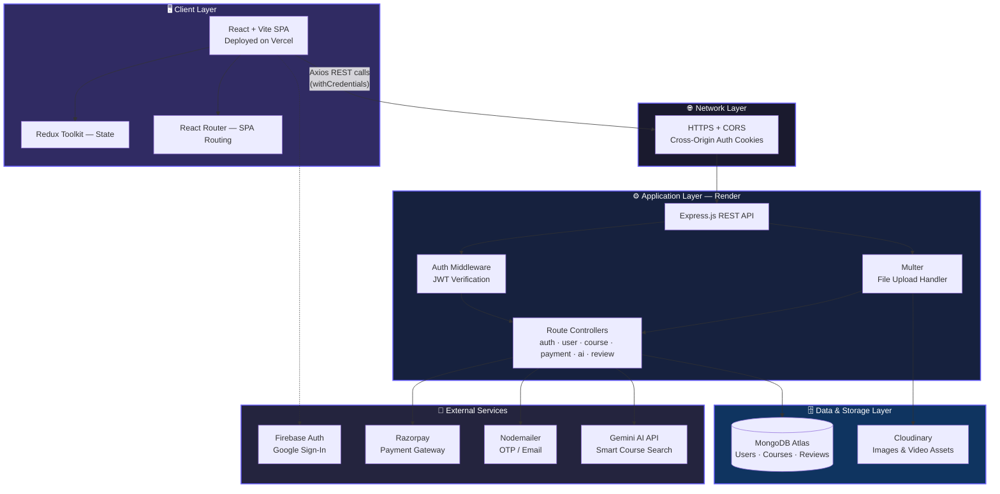
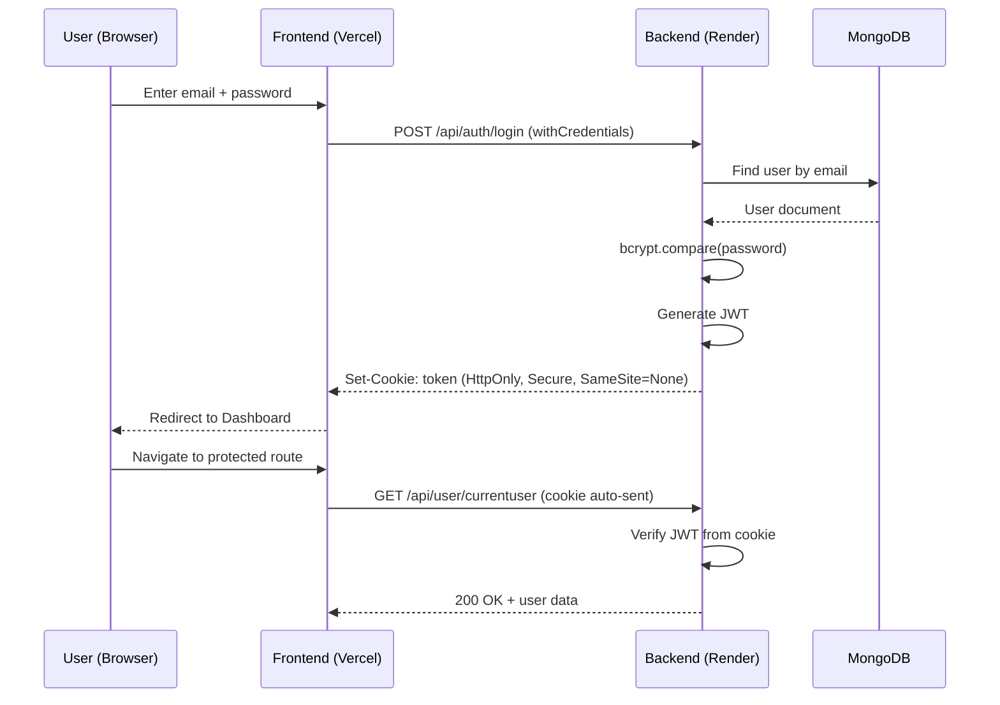

<div align="center">


<br/><br/>

<p>
  
  
  
  
</p>
<p>
  
  
  
  
</p>

<p>
  
  
  
</p>

</div>

<br/>

## 📖 Overview

**Virtual Courses** is a production-grade **MERN stack e-learning platform** where **educators** create and sell structured video courses, and **students** discover, purchase, and learn from them. It combines secure authentication, cloud media handling, real payment processing, and AI-assisted discovery into one cohesive product — architected the way a real SaaS learning platform would be.

<br/>

## 🏗️ System Architecture



<br/>

## 🔄 Authentication Flow



<br/>

## ✨ Key Features

<table>
<tr>
<td width="50%" valign="top">

### 👤 Authentication & Profile
- Signup/Login with bcrypt-hashed passwords
- JWT sessions via secure HTTP-only cookies
- Google Sign-In (Firebase Auth)
- OTP-based forgot/reset password via email
- Editable profile with Cloudinary avatar upload

### 🎓 Learning Experience
- Browse & search all published courses
- Rich course detail pages with curriculum preview
- Sequential lecture player for enrolled students
- Enrollment tracking per user
- Star-rating & written reviews per course
- **AI-powered course search** (Gemini API)

</td>
<td width="50%" valign="top">

### 🧑‍🏫 Educator Tools
- Role-based access — Educator-only routes
- Course creation → lecture creation → publish flow
- Edit/manage lectures within a course
- Personal dashboard of created courses

### 💳 Payments & Commerce
- Razorpay checkout integration
- Server-side payment verification
- Automatic enrollment on successful purchase

### 🛡️ Engineering
- CORS-secured cross-origin cookie auth
- Environment-based secret management
- Cloud DB (MongoDB Atlas) + Cloud media (Cloudinary)

</td>
</tr>
</table>

<br/>

## 🛠️ Tech Stack

| Layer | Technology |
|---|---|
| **Frontend** | React 19 · Vite · Redux Toolkit · React Router v7 · Tailwind CSS 4 |
| **Backend** | Node.js · Express.js |
| **Database** | MongoDB + Mongoose |
| **Auth** | JWT · bcryptjs · Firebase (Google OAuth) |
| **File Uploads** | Multer + Cloudinary |
| **Payments** | Razorpay |
| **Email** | Nodemailer (OTP delivery) |
| **AI** | Google Gemini API |
| **Hosting** | Vercel (Frontend) · Render (Backend) |

<br/>

## 📂 Project Structure

```
Virtual-Course/
├── backend/
│   ├── configs/          → DB, Cloudinary, Mail, Token setup
│   ├── controllers/      → auth, user, course, payment, ai, review logic
│   ├── middlewares/      → isAuth guard, Multer upload handler
│   ├── models/           → Mongoose schemas
│   ├── routes/           → Express route definitions
│   └── index.js          → Server entry point
│
└── frontend/
    ├── src/
    │   ├── pages/           → Login, SignUp, Dashboard, ViewCourse, etc.
    │   ├── pages/admin/      → Educator dashboard pages
    │   ├── components/       → Reusable UI components
    │   ├── customHooks/      → Data-fetching hooks
    │   ├── redux/             → Redux Toolkit slices
    │   └── App.jsx             → Root routes
    └── vercel.json              → SPA rewrite config
```

<br/>

## ⚙️ Environment Variables

**`backend/.env`**
```env
PORT=8000
MONGODB_URL=
JWT_SECRET=
CLOUDINARY_CLOUD_NAME=
CLOUDINARY_API_KEY=
CLOUDINARY_API_SECRET=
EMAIL=
EMAIL_PASS=
RAZORPAY_KEY_ID=
RAZORPAY_SECRET=
GEMINI_API_KEY=
```

**`frontend/.env`**
```env
VITE_API_URL=
```

> ⚠️ Never commit `.env` files — confirm they're listed in `.gitignore` before pushing.

<br/>

## 🚀 Getting Started

```bash
# 1. Clone
git clone https://github.com/Biswajitpa/Virtual-Course.git
cd Virtual-Course

# 2. Backend
cd backend
npm install
npm start

# 3. Frontend (in a new terminal)
cd frontend
npm install
npm run dev
```

Frontend runs at `http://localhost:5173`, connecting to backend at `http://localhost:8000`.

<br/>

## 🌐 Live Deployment

| Service | Platform | Purpose |
|---|---|---|
| Frontend | **Vercel** | React SPA hosting |
| Backend | **Render** | REST API server |
| Database | **MongoDB Atlas** | Persistent data storage |
| Media | **Cloudinary** | Avatar & course asset storage |

<br/>

## 🗺️ Roadmap

- [ ] Course completion certificates
- [ ] Resume-from-last-lecture progress tracking
- [ ] Discussion forum per course
- [ ] Wishlist & course bundles
- [ ] Multi-language support

<br/>

---

<div align="center">

## 👨‍💻 Developed By


### **Biswajit Pattanaik**

<a href="https://github.com/Biswajitpa"></a>

<br/><br/>

⭐ **If this project helped or inspired you, consider giving it a star!** ⭐


</div>
